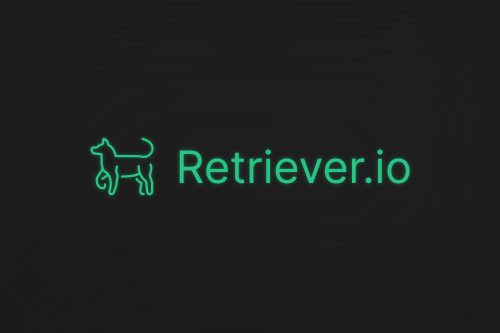

 

<i>An user friendly GUI for yt-dlp</i>

  
  
  

## 🐕 Introduction

 
Completely free, Retriever.io is a Open Source GUI that works as a frontend for yt-dlp, with a focus on making it easier to use for users with no programming experience.

Access the [app repository](https://github.com/gustavofdasilva/retriever.io) to know more.

 

## 💬Stay in touch
- [Roadmap and Goals](https://github.com/gustavofdasilva/retriever.io/discussions/1)
- [Instagram](https://www.instagram.com/retriever.io.app/)
- [X - Twitter](https://x.com/retriever_io)

 

## 🎨Assets used

### Logo

[OpenMoji](https://openmoji.org/library/emoji-1F415/#variant=black). License: [CC BY-SA 4.0](https://creativecommons.org/licenses/by-sa/4.0/#)

### Components
- [Prime vue](https://primevue.org)

### Icons

- [Prime icons](https://github.com/primefaces/primeicons)
- [Fontawesome](https://fontawesome.com)

### Background images

- [Haikei](https://app.haikei.app)

 

## 📃License
Retriever.io is licensed under the [MIT License](https://opensource.org/license/mit). See the LICENSE file for more information.
